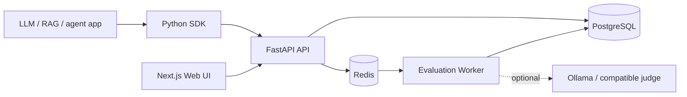
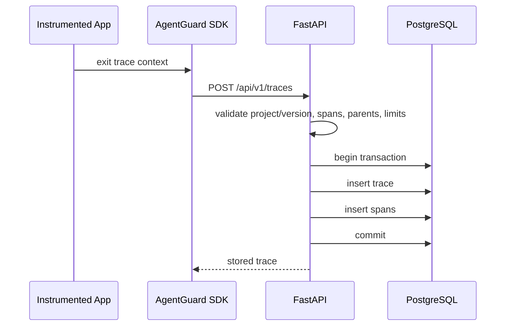

# AgentGuard Architecture

AgentGuard is a monorepo with an async FastAPI API, PostgreSQL persistence, Redis/ARQ evaluation
workers, a Python instrumentation SDK, reference applications, and a Next.js decision UI.

## Trace Ingestion Flow

## Persistence

PostgreSQL stores relational ownership and span topology while JSONB fields preserve heterogeneous AI inputs, outputs, metadata, and attributes.

`TIMESTAMPTZ` is used throughout. `duration_ms` is derived from canonical `started_at` and `ended_at` values server-side.

Test suites store expected behavior independently from traces. Evaluation jobs connect one suite,
version, evaluator, and request ID; job-case rows connect every case to its exact trace and evaluator
result. Comparison selects the latest terminal execution for each suite/version/evaluator and pairs
the same case/evaluator across versions. Release decisions are deterministic API responses computed
from stored evidence, not LLM opinions or persisted deployment approvals.

## Future Work

Incremental and streaming span ingestion are deliberately not part of the current build.
Cursor/keyset pagination and generated TypeScript clients are also future improvements if offset
pagination or manual API models become costly.
