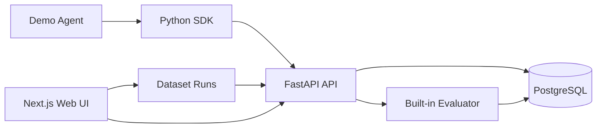
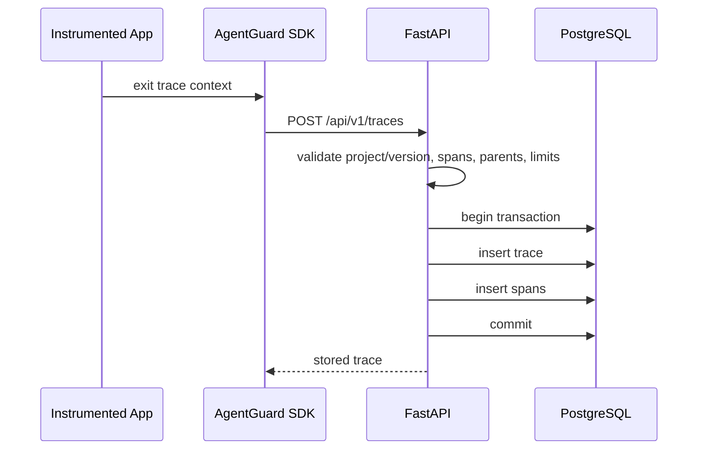

# AgentGuard Architecture

AgentGuard is a monorepo with an async FastAPI API, PostgreSQL persistence, a Python
instrumentation SDK, a deterministic demo agent, and a Next.js web UI for trace inspection,
golden datasets, and initial evaluations.

## Trace Ingestion Flow

## Persistence

PostgreSQL stores relational ownership and span topology while JSONB fields preserve heterogeneous AI inputs, outputs, metadata, and attributes.

`TIMESTAMPTZ` is used throughout. `duration_ms` is derived from canonical `started_at` and `ended_at` values server-side.

Datasets store expected behavior independently from traces. A dataset-case run creates a fresh trace
and then records an evaluation result against that trace and case. Evaluation results are stored
separately from traces so later evaluator types can reuse the same trace model. Release decisions
are calculated from stored version summaries and comparisons; they are deterministic API responses,
not persisted deployment approvals.

## Future Work

Incremental and streaming span ingestion are deliberately not part of the current build.
Cursor/keyset pagination and generated TypeScript clients are also future improvements if offset
pagination or manual API models become costly.
